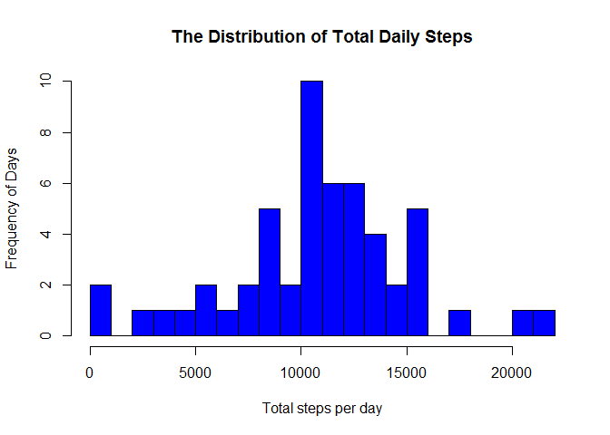
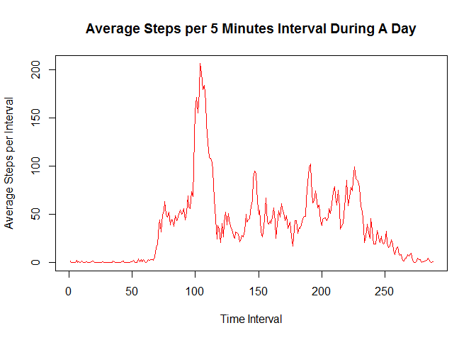
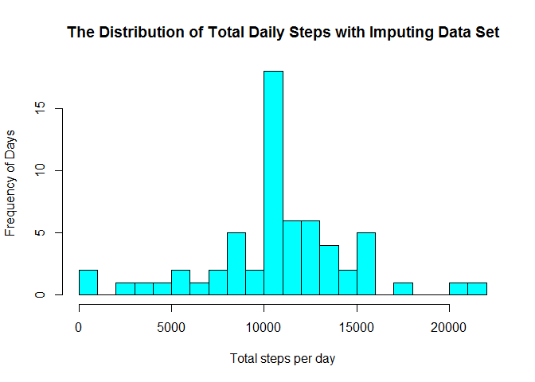
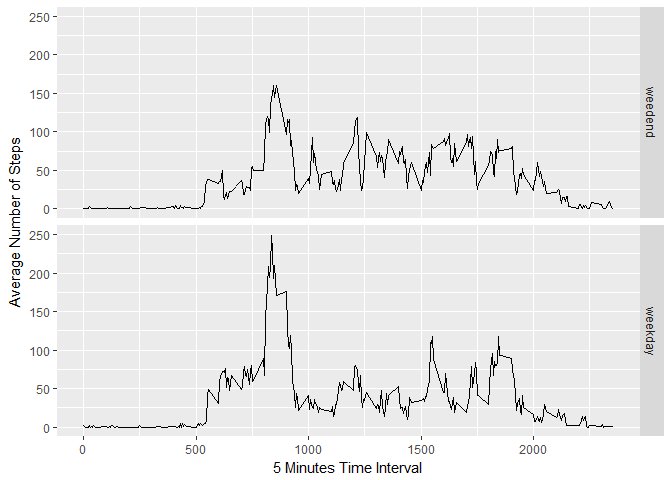

# Reproducible Research: Peer Assessment 1


##Loading and preprocessing the data

Read the data from current working directory and change the date column to Date class

```r
activity <- read.csv("activity.csv", header=TRUE, sep=",", colClasses = c("numeric", "character", "numeric"))
activity$date<-as.Date(activity$date, format="%Y-%m-%d")
```
##Load the necessary library

```r
library(dplyr)
```

```
## 
## Attaching package: 'dplyr'
```

```
## The following objects are masked from 'package:stats':
## 
##     filter, lag
```

```
## The following objects are masked from 'package:base':
## 
##     intersect, setdiff, setequal, union
```

```r
library(ggplot2)
```

##What is mean total number of steps taken per day? Make a histogram of the total number of steps taken each day. 
Missing values will be ignored for this analysis.  


```r
steps_per_day<-aggregate(steps~date, activity, sum)
hist(steps_per_day$steps, breaks=20, xlab="Total steps per day", ylab="Frequency of Days",
     main="The Distribution of Total Daily Steps", col="blue")
```

<!-- -->

## Calculate and report the mean and median total number of steps taken per day

```r
mean_steps <- mean(steps_per_day$steps, na.rm=TRUE)
median_steps <- median(steps_per_day$steps, na.rm=TRUE)
mean_steps
```

```
## [1] 10766.19
```

```r
median_steps
```

```
## [1] 10765
```

The mean of the total number of steps taken per day is 1.0766189\times 10^{4}.
The median of the total number of steps taken per day is 1.0765\times 10^{4}.

##What is the average daily activity pattern?

A time series plot (type = "l") of the 5-minute interval (x-axis) and the average number of steps taken, averaged across all days (y-axis) is drawn below.


```r
average_steps<-tapply(activity$steps, activity$interval, mean, na.rm=TRUE)
plot(average_steps, type = "l", col="red", xlab = "Time Interval", ylab="Average Steps per Interval", 
    main="Average Steps per 5 Minutes Interval During A Day")
```

<!-- -->

##Which 5-minute interval, on average across all the days in the dataset, contains the maximum number of steps?

```r
max<-activity$interval[which.max(average_steps)]
```

The time interval corresponding to maximum average number of steps per day is 835.  

##Imputing missing values

Note that there are a number of days/intervals where there are missing values (coded as NA). The presence of missing days may introduce bias into some calculations or summaries of the data.

1. Calculate and report the total number of missing values in the dataset (i.e. the total number of rows with NAs)

```r
totalmissing<-sum(is.na(activity))
```

The total missing values is 2304.

2. All the missing values are replaced by the mean for that 5-minute interval.

The new dataset that is equal to the original dataset but with the missing data filled in is constructed below.

```r
activity_merge<-cbind(activity,rep(average_steps,61))
names(activity_merge)=c("steps", "date","interval", "Average_Steps")
activity_merge<-activity_merge %>% mutate(steps=ifelse(is.na(steps),Average_Steps, steps))
```

##Make a histogram of the total number of steps taken each day and Calculate and report the mean and median total number of steps taken per day. Do these values differ from the estimates from the first part of the assignment? What is the impact of imputing missing data on the estimates of the total daily number of steps?

```r
steps_per_day_i<-aggregate(steps~date, activity_merge, sum)
hist(steps_per_day_i$steps, breaks=20, xlab="Total steps per day", ylab="Frequency of Days",
     main="The Distribution of Total Daily Steps with Imputing Data Set", col="cyan")
```

<!-- -->

The overall trend for the histogram is very similiar.

```r
mean_steps_i <- mean(steps_per_day_i$steps)
median_steps_i <- median(steps_per_day_i$steps)
mean_steps_i
```

```
## [1] 10766.19
```

```r
median_steps_i
```

```
## [1] 10766.19
```

Before imputing the NA value, the mean of the total number of steps taken per day is 1.0766189\times 10^{4} and the median of the total number of steps taken per day is 1.0765\times 10^{4}.After imputing the NA value with mean steps of that time interval, the new mean of the total number of steps taken per day is 1.0766189\times 10^{4} and the median of the total number of steps taken per day is 1.0766189\times 10^{4}. The mean value is same and median value overlap with the mean value.

#Are there differences in activity patterns between weekdays and weekends?

For this part the weekdays() function is used for the dataset with the filled-in missing values. A new factor variable is added to the dataset with two levels -- "weekday" and "weekend" indicating whether a given date is a weekday or weekend day.


```r
weekday<-c("Monday","Tudesday","Wednesday","Thursday","Friday")
activity_merge$date_type[weekdays(activity_merge$date) %in% weekday]<-"weekday"
activity_merge$date_type[is.na(activity_merge$date_type)]<-"weedend"
activity_merge$date_type<-as.factor(activity_merge$date_type)
final<-activity_merge[,c(1,2,3,5)]
```

##Make a panel plot containing a time series plot (type = "l") of the 5-minute interval (x-axis) and the average number of steps taken, averaged across all weekday days or weekend days (y-axis).


```r
average_final <- aggregate(steps ~ interval + date_type, data=final, mean)
ggplot(average_final, aes(interval, steps)) + geom_line() + facet_grid(date_type ~ .) + xlab("5 Minutes Time Interval") + ylab("Average Number of Steps")
```

<!-- -->

The degree of the pattern is different.
